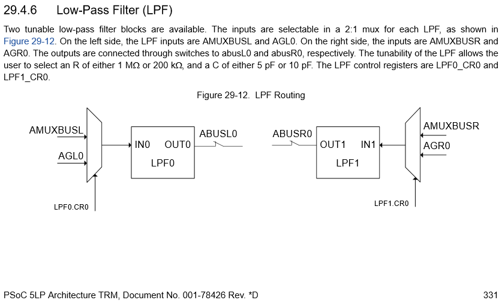

# PSoC のコンポーネントを作ろう!


**この記事は [高知工科大学 Advent Calender 2015](http://www.adventar.org/calendars/965) の 12/25 の記事です**

## はじめに
どうも、ラスト担当の [＼ﾋｯｶﾘｰﾝ／](https://github.com/s-nlf-fh) です。

みなさん **PSoC** 使ってますか? 私は **PSoC** 大好きです。

さてマイコンといえば PIC おじさんとか SH おじさんが沸いてきそうですが、最近は [Arduino][arduino] とか [mbed][mbed] とかが流行ってるみたいです。
それもこれも超お手軽だからですね。
ですがお手軽さでいえば **PSoC** だって負けていません。
なんたって[回路図を書くだけでLチカ](http://www.pwv.co.jp/~take/TakeWiki/index.php?PSoC4%2FLEDチカチカ（ハード版）)できるくらいですからね。

今回はその **PSoC** のコンポーネントを作る際の手順について書きます。

PICおじさんの例


## 環境
今回は [**PSoC Creator 3.3**][Creator] と [**PSoC 5**][PSoC5] を使用します。
**PSoC 5** は秋月電子で [**PSoC 5LP Prototyping Kit**][PSoC5] というお手軽ボードが売っているので持ってない人は今すぐポチろう!

## **LPF**
突然ですが **Analog** タブ にある **LPF** の存在を知っていますか?


実はこれを使おうとしてもコンポーネントがありません。


っていうのは嘘で **PSoC Creator** のメニューバーの **Tools -> Options** から **Options** のウィンドウを開いて **Design Entry -> Component Catalog** の **Show Hidden Components** のチェックを付けます。


すると **Component Catalog** に **Analog Primitives -> lpf** が現れます。


でもこのコンポーネントはカットオフ周波数とかを設定する項目とかがなくて使い物になりません。


なのでこいつをラップしたコンポーネントを作っていきたいと思います。

が、その前にもう少し **LPF** について調べてみます。

**[TRM][]** の **Low Pass Filter** の項目を見るとこの **LPF** はRCフィルタで
**R: 1M, 200k , C: 5p, 10p** が選択できるようです。
<br />なのでカットオフ周波数は **15k, 30k, 76k, 153k** の4つになります。



そしてこれらを設定するためには **LPFn_CR0** のレジスタをいじれば良いそうなので **[Registers TRM][RegTRM]** の該当箇所を見ます。


これによると **csel** と **rsel** を設定すれば良いみたいなので

|f|R|C|LPFn_CR0|
|---|---|---|---|
|15k|1M|10p|0x30 = 48|
|30k|1M|5p|0x10 = 16|
|76k|200k|10p|0x20 = 32|
|153k|200k|5p|0x00 = 0|

となります。

ちなみにデータシートとかのドキュメントを探すときは **PSoC Creator** と一緒にインストールされる **Cypress Document Manager** が超便利なのでこれを使いましょう。

## コンポーネントを作ろう

### Symbol作成
**Workspacd Explorer -> Components** のタブを開いて **Project 'Project name'** を右クリックし **Add Component Item** をクリック


するとなんか出てくるので **Symbol Wizard** を選択
**Component name** を **LPF_v0_0** にして **Create New** !


そのあと下図のように Pin 名などを設定して **OK** を押します。


するとコンポーネントの Symbol ができるので、ちょっと形とかを整えて Symbol の完成!

### Properties の設定
Symbol の近くの空白部分を右クリックして **Properties** をクリック


**Properties** を設定するウィンドウが出てくるので **Symbol** のとこを下図のように設定


### Parameters の作成
また Symbol 横の空白を右クリックして **Symbol Parameters** をクリック
<br />ここでカットオフ周波数のパラメータを追加するのですが、まず左下の **Types** をクリックし新しく **LPF_CUT_OFF** という列挙型を作ります。
それから **CutOffFreq** という名前の **LPF_CUT_OFF** 型のパラメータを追加します。


### 回路図の作成
**Workspace Explorer -> Components** で **LPF_v0_0** を右クリックし **Add Component Item** をクリック


するとまたなんか出てくるので今度は **Schematic** を選択
<br /> **Analog Primitives -> lpf** を配置して **Symbol Wizard** で設定したPin名と同じ名前の **Terminal** を付けます。


### APIの作成
また **Workspace Explorer -> Components** で **LPF_v0_0** を右クリックし **Add Component Item** をクリックし
**API C File** と **API Header File** から **LPF.c** と **LPF.h** を作成

**LPF.h**
```C
#ifndef LPF_`$INSTANCE_NAME`_H
#define LPF_`$INSTANCE_NAME`_H

#include "cytypes.h"
#include "cyfitter.h"

`#DECLARE_ENUM LPF_CUT_OFF`
enum `$INSTANCE_NAME`_CUTOFF_FREQ {
	`$INSTANCE_NAME`_15kHz = `$INSTANCE_NAME`__LPF_15KHZ,
	`$INSTANCE_NAME`_30kHz = `$INSTANCE_NAME`__LPF_30KHZ,
	`$INSTANCE_NAME`_76kHz = `$INSTANCE_NAME`__LPF_76KHZ,
	`$INSTANCE_NAME`_153kHz = `$INSTANCE_NAME`__LPF_153KHZ
};

void `$INSTANCE_NAME`_Start();
void `$INSTANCE_NAME`_SetCutoffFreq(enum `$INSTANCE_NAME`_CUTOFF_FREQ);

#endif // LPF_`$INSTANCE_NAME`_H
```

**LPF.c**
```C
#include "`$INSTANCE_NAME`.h"

#define `$INSTANCE_NAME`_CR_MASK (`$INSTANCE_NAME`__LPF_15KHZ | `$INSTANCE_NAME`__LPF_30KHZ | `$INSTANCE_NAME`__LPF_76KHZ | `$INSTANCE_NAME`__LPF_153KHZ)

void `$INSTANCE_NAME`_Start() {
	`$INSTANCE_NAME`_SetCutoffFreq((enum `$INSTANCE_NAME`_CUTOFF_FREQ)`$CutOffFreq`);
}

void `$INSTANCE_NAME`_SetCutoffFreq(const enum `$INSTANCE_NAME`_CUTOFF_FREQ cutoff) {
	const void CYFAR *pCR = (void CYFAR*)`$INSTANCE_NAME`_lpf_1__CR0;
	const uint8 nextCR = (CY_GET_XTND_REG8(pCR) & ~`$INSTANCE_NAME`_CR_MASK) | cutoff;
	CY_SET_XTND_REG8(pCR, nextCR);
}
```

** \`$ParamName\` ** はこのコンポーネントのインスタンスのパラメータに置き換わります。
<br />** \`$DECLARE_ENUM TypeName\` ** は **Symbol Parameters** の設定のとこで作成した列挙型を定義した Define に置き換わります。
<br /> 詳しくは [Component Author Guide][AuthorGuide] を見てください。

##完成!!
いつもの **TopDesign.cysch** に戻ってください。
<br />すると **Component Catalog** に **Custum** タブが追加され **Analog -> LPF** コンポーネントが出てきました。


生成された API ファイルはこうなってます

**LPF_1.h**
```C
#ifndef LPF_LPF_1_H
#define LPF_LPF_1_H

#include "cytypes.h"
#include "cyfitter.h"

#define LPF_1__LPF_15KHZ 48
#define LPF_1__LPF_30KHZ 16
#define LPF_1__LPF_76KHZ 32
#define LPF_1__LPF_153KHZ 0

enum LPF_1_CUTOFF_FREQ {
	LPF_1_15kHz = LPF_1__LPF_15KHZ,
	LPF_1_30kHz = LPF_1__LPF_30KHZ,
	LPF_1_76kHz = LPF_1__LPF_76KHZ,
	LPF_1_153kHz = LPF_1__LPF_153KHZ
};

void LPF_1_Start();
void LPF_1_SetCutoffFreq(enum LPF_1_CUTOFF_FREQ);

#endif // LPF_LPF_1_H
```

**LPF_1.c**
```C
#include "LPF_1.h"

#define LPF_1_CR_MASK (LPF_1__LPF_15KHZ | LPF_1__LPF_30KHZ | LPF_1__LPF_76KHZ | LPF_1__LPF_153KHZ)

void LPF_1_Start() {
	LPF_1_SetCutoffFreq((enum LPF_1_CUTOFF_FREQ)16);
}

void LPF_1_SetCutoffFreq(const enum LPF_1_CUTOFF_FREQ cutoff) {
	const void CYFAR *pCR = (void CYFAR*)LPF_1_lpf_1__CR0;
	const uint8 nextCR = (CY_GET_XTND_REG8(pCR) & ~LPF_1_CR_MASK) | cutoff;
	CY_SET_XTND_REG8(pCR, nextCR);
}
```
超簡単でしたね。

## 結論

+ **Cypress Document Manager は神**
+ **[Component Author Guide][AuthorGuide] を読もう**
+ **[TRM][] を読もう**
+ **[Registers TRM][RegTRM] を読もう**
+ **[ARM Cortex Code Optimization][Optimization] とかも読もう**

---
[Arduino とは][arduino]


[mbed とは][mbed]


[PSoC5]: http://akizukidenshi.com/catalog/g/gM-09432/
[Creator]: http://japan.cypress.com/products/psoc-creator-integrated-design-environment-ide
[AuthorGuide]: http://www.cypress.com/documentation/component-datasheets/psoc-creator-component-author-guide
[TRM]: http://www.cypress.com/documentation/technical-reference-manuals/psoc-5lp-architecture-trm
[RegTRM]: http://www.cypress.com/documentation/technical-reference-manuals/psoc-5lp-registers-trm-technical-reference-manual
[Optimization]: http://www.cypress.com/documentation/application-notes/an89610-psoc-4-and-psoc-5lp-arm-cortex-code-optimization
[arduino]: https://www.arduino.cc/
[mbed]: https://www.mbed.com/

